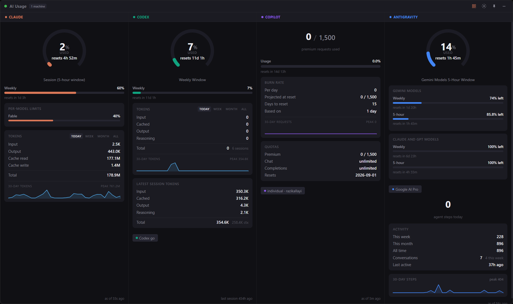
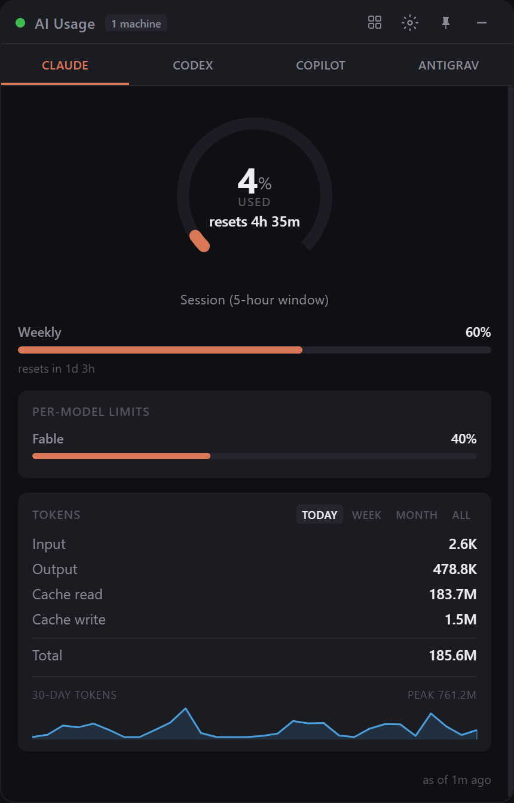

<div align="center">

# AI Usage Widget

**Know how much AI quota you have left — without checking four different places.**

One always-on-top window showing live usage for **Claude**, **Codex**, **GitHub Copilot** and
**Antigravity**. Everything is read from your own machine: no cloud relay, no account, no telemetry.

[](https://github.com/razikallayi/ai-usage-widget/releases/latest)
[](https://github.com/razikallayi/ai-usage-widget/releases)
[](https://github.com/razikallayi/ai-usage-widget/stargazers)


### [⬇ Download for Windows](https://github.com/razikallayi/ai-usage-widget/releases/latest)

*One file. No setup — it finds your tools by itself.*



</div>

## The problem

Every AI coding tool hides "how much have I used?" somewhere different — a settings panel here, a CLI
there, a web dashboard for another, and for one of them nowhere obvious at all. If you use more than
one, there is no single answer to *am I about to hit my weekly limit?*

This puts all of them in one small window you can park in a corner.

## Two layouts

<table>
<tr>
<td width="45%" valign="top">



</td>
<td valign="top">

**Tabs mode** — a narrow column, one source at a time. Good for parking beside your editor.

**Wide mode** (the screenshot at the top) — all four side by side.

Toggle with the grid icon in the titlebar; your choice is remembered, and each layout keeps its own
size and position, because four columns want ~1400px while one tab wants ~350.

Both show the *same* full detail. Wide mode reuses the identical renderers, so there is no
second, cut-down view that drifts out of date.

</td>
</tr>
</table>

## What you get

- **Claude** — 5-hour window gauge, weekly bar, per-model limits, token usage with a
  Today/Week/Month/All switcher, and a 30-day sparkline
- **Codex** — rate limit gauge, weekly bar, latest-session token totals
- **Copilot** — premium interaction quota, burn rate, and projected usage at reset
- **Antigravity** — 5-hour and weekly quota per model group, plus activity counts and a sparkline
- **Live countdowns** to every reset, ticking every second
- **Colour escalation** at 80% (amber) and 95% (red), so it reads at a glance in peripheral vision
- **Freshness dots** per section, so you can tell stale data from real zeros
- Frameless, adjustable opacity, closes to the **system tray**, optional autostart
- **Graceful degradation** — a tool you don't use, or one that isn't running, greys out its own
  section and says why. It never blanks the rest of the widget.

## Download

Grab a single file from the [latest release](https://github.com/razikallayi/ai-usage-widget/releases/latest):

| File | Use it if |
|---|---|
| **`AI.Usage.Widget.Setup.1.0.1.exe`** | You want it installed — creates Start Menu and desktop shortcuts. Per-user, so no admin prompt. |
| **`AI.Usage.Widget.1.0.1.exe`** | You just want to try it. Portable, installs nothing. |

It starts in the **system tray**, so if no window appears, look there.

> **SmartScreen warning:** these builds are not code signed (a certificate costs a few hundred dollars
> a year), so Windows will call the publisher unknown. Choose *More info → Run anyway*, verify the
> checksums in the [release notes](https://github.com/razikallayi/ai-usage-widget/releases/latest), or
> build it yourself from source — see [From source](#from-source).

## It configures itself on a new PC

There is no setup step and nothing to paste. On first launch it mints its own local token, starts its
collector, and finds everything in the standard per-user locations — so it picks up whichever accounts
are signed in on *that* machine:

| Source | Detected from |
|---|---|
| Claude | `~/.claude/.credentials.json` and `~/.claude/projects/` — whatever Claude Code is signed into |
| Codex | `~/.codex/sessions/` |
| Copilot | `gh auth token`, i.e. whichever GitHub account the CLI is logged into. `gh` is found on `PATH` or in its usual install directories |
| Antigravity | Its language server, discovered live each cycle — the port and token change every launch, so nothing is remembered |

No paths, usernames, tokens or machine names are baked into the build. Anything you haven't installed
just leaves its section empty — nothing to disable. Per-machine settings live in
`%APPDATA%/usage-widget/`.

## Privacy

This reads credentials, so it is worth being exact about what happens to them:

- **Nothing is transmitted anywhere except each vendor's own API**, using the credential that vendor
  already issued to you. There is no relay, no analytics, no crash reporting, and no outbound call to
  any server the author controls.
- **`~/.claude/.credentials.json` is opened read-only and never written.** Claude Code owns that file
  and refreshes it; writing to it could clobber a live session.
- The collector listens on `127.0.0.1` only, and rejects any request without the locally generated
  bearer token (compared in constant time).
- From Antigravity's status response only the **plan name** is kept. That response also carries the
  signed-in account name and email; this widget has no reason to hold either, so it doesn't.
- All state stays on your machine. Both files it writes are gitignored.

## How it works

Two processes:

```text
┌─────────────────────────┐         ┌──────────────────────────────┐
│  Electron widget        │  HTTP   │  Local collector             │
│  (renderer + tray)      ├────────▶│  127.0.0.1:8787              │
│                         │  Bearer │  GET /v1/summary             │
└─────────────────────────┘         └───────────┬──────────────────┘
                                                │ reads
                    ┌───────────────────────────┼───────────────────────────┐
                    ▼                ▼          ▼            ▼              ▼
              ~/.claude/       ~/.codex/    gh auth    Antigravity     ~/.gemini/
              (creds + logs)   sessions    token→API   language server  conversations
```

The widget polls `GET http://127.0.0.1:8787/v1/summary` with a bearer token and renders the JSON. The
collector is a dependency-free Node HTTP server that gathers each signal on its own schedule and
caches the result. The app spawns it automatically, so there is nothing to wire up.

### Where each number comes from

| Section | Source |
|---|---|
| Claude limits | `GET api.anthropic.com/api/oauth/usage`, authorised with the OAuth token Claude Code already stores locally. Gives the 5-hour and 7-day windows plus per-model limits. |
| Claude tokens | Your local Claude Code transcripts. Parsed incrementally — byte offsets and daily totals are cached, so a few hundred transcripts cost milliseconds per poll. Deduped by message id, because resuming a session replays earlier messages into a new file. |
| Codex limits | The newest rollout log under `~/.codex/sessions/`, reading the last recorded rate-limit event. |
| Copilot quota | `gh auth token` → GitHub's Copilot user endpoint. Undocumented, so treated as a soft failure. |
| Antigravity quota | Antigravity's **own local language server**, over loopback — the same source that backs its Settings → Models & Usage panel, so the numbers match exactly. Needs Antigravity **running**. |
| Antigravity activity | The local conversation databases under `~/.gemini/antigravity/conversations/`. Independent of the quota call, so activity counts work whether or not Antigravity is open. |

Every source is isolated. When one fails it nulls only its own section, adds a line to `warnings[]`,
and **keeps the last good value** so the section ages visibly instead of going blank.

### Polling cadence

Each source polls at its own rate — the Anthropic usage endpoint answers `429` well below a
30-second cadence, while local file scans are essentially free. These windows move over hours, so
polling slowly costs nothing in accuracy.

| Source | Interval | Why |
|---|---|---|
| Claude limits | 120s | Rate limited; the windows are hours long |
| Claude tokens | 30s | Local, incremental file scan |
| Codex | 30s | Local file scan |
| Copilot | 300s | It's a monthly counter |
| Antigravity activity | 60s | Local database scan, cached on mtime |
| Antigravity quota | 120s | Local RPC, no faster than the panel updates |

A `429` doubles that source's interval, capped at 15 minutes, clearing on the next success. Because
the cadences differ, staleness colours are per-section rather than one global rule — otherwise the
Copilot dot would sit permanently red.

## From source

```bash
git clone https://github.com/razikallayi/ai-usage-widget.git
cd ai-usage-widget
npm install
npm start
```

```bash
npm start            # launch the widget
npm run dev          # launch with DevTools open
npm run collector    # run the collector on its own; prints its URL + read token
npm run dist:win     # build your own installer + portable exe into dist/
npm run icon         # regenerate assets/icon.ico and tray-icon.png
```

Requirements: Windows 10/11, Node.js 18+ to install (the app itself runs on Electron's bundled Node),
and whichever tools you want to track — each is optional.

### Autostart

```bash
npm run launcher                      # create a shortcut + register autostart
npm run launcher -- -DelayMinutes 5   # same, with a different startup delay
npm run launcher:remove               # remove the shortcut, task, and startup script
```

This creates a shortcut pointing straight at Electron (so there's no console window) and a scheduled
task that starts the widget a couple of minutes after logon, once Windows has settled. The task runs
unelevated on purpose: an elevated always-on-top window can't exchange drag-drop or clipboard with
normal apps. Relaunching is safe — the app holds a single-instance lock and focuses the existing
window.

## Configuration

Settings are in the in-app modal (gear icon, or the tray menu), persisted to
`%APPDATA%/usage-widget/config.json`:

| Key | Default | Meaning |
|---|---|---|
| `viewMode` | `wide` | `tabs` or `wide` |
| `opacity` | `1` | Window opacity |
| `alwaysOnTop` | `true` | Keep above other windows |
| `pollIntervalMs` | `20000` | How often the widget re-polls the collector |
| `collectorAutoStart` | `true` | Set `false` to run the collector yourself |
| `collectorPort` | `8787` | Collector port |
| `windowBounds` / `wideBounds` | — | Geometry, one per layout |

> **Don't hand-edit `config.json` while the widget is running** — window bounds are saved on a
> debounce, so your edit gets overwritten seconds later. Quit first.

## Troubleshooting

**Start with `warnings[]`** — it names any source that failed, and why:

```bash
curl -H "Authorization: Bearer <readToken>" http://127.0.0.1:8787/v1/summary
```

**Throttled or actually broken?** From outside, both look like an empty section. `GET /health`
distinguishes them, reporting `hasValue`, `lastOkSec`, `lastTrySec`, `backoffSec` and `lastError` per
source. A `backoffSec` above zero means throttled, not failing.

```bash
curl http://127.0.0.1:8787/health
```

**The Antigravity tab says quota unavailable.** Its quota comes from Antigravity's local language
server, so Antigravity has to be running. Activity counts keep working regardless.

**The Codex tab looks stale.** Codex reports two different ages: collector freshness (the titlebar
dot) versus "last session *N*h ago" in the footer, which is how long since you last used Codex. An
idle Codex is not a broken collector.

**`Cannot read properties of undefined (reading 'requestSingleInstanceLock')`.** Something in your
environment set `ELECTRON_RUN_AS_NODE=1`, which makes Electron boot as plain Node. `npm start` goes
through `launch.js`, which strips it; launching Electron directly from such a shell doesn't. Clear the
variable, or launch from Explorer.

**Every setting reset itself.** The config file was probably saved with a UTF-8 BOM by Notepad or
`Set-Content -Encoding UTF8`. It's stripped on load now, and an unparseable file is moved aside to
`config.json.bak` rather than silently discarded.

## Demo mode

Realistic mock data, for working on the UI without waiting on live sources — and for screenshots
without publishing your own account details:

```js
// DevTools console (npm run dev)
window.demo.start()
window.demo.stop()
```

`src/renderer/scripts/pages/demo.js` is also the authoritative description of the API payload shape;
the page renderers were written against it.

## Project layout

```text
collector/          zero-dependency Node HTTP server
  sources/          one module per data source, each independently failable
  server.js         scheduling, per-source backoff, /v1/summary + /health
src/main/           Electron main process: window, tray, IPC, config, collector spawn
src/renderer/
  scripts/pages/    one renderer per tab, plus demo.js (the payload contract)
  scripts/          gauges, sparklines, countdowns, staleness, settings
  styles/           CSS; wide mode is CSS-only
scripts/            PowerShell: launcher install/uninstall, icon generation
```

## Known limitations

- **Windows only.** The launcher and autostart scripts are PowerShell + Task Scheduler. The app and
  collector themselves are largely portable, so a port isn't a big lift — PRs welcome.
- **Not code signed**, so SmartScreen warns about an unknown publisher.
- The **Copilot** endpoint is undocumented and may break without notice.
- **Antigravity quota needs Antigravity running.**
- Autostart is currently a source-checkout feature; the installed build doesn't register it yet.

## Contributing

Issues and PRs are welcome — especially a macOS or Linux port, or another tool worth adding. Each data
source is a single self-contained module under `collector/sources/` that either returns a value or
throws, so adding one is a small, isolated job.

---

<div align="center">

**If this saves you a trip to four different settings pages, a ⭐ helps other people find it.**

[⭐ Star](https://github.com/razikallayi/ai-usage-widget/stargazers) ·
[🍴 Fork](https://github.com/razikallayi/ai-usage-widget/fork) ·
[⬇ Download](https://github.com/razikallayi/ai-usage-widget/releases/latest) ·
[🐛 Report an issue](https://github.com/razikallayi/ai-usage-widget/issues)

MIT licensed — see [LICENSE](LICENSE).

</div>
